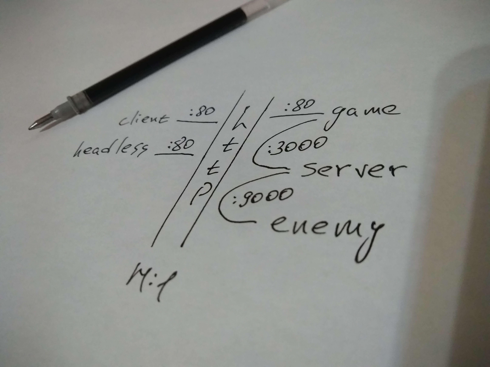

# Игровой сервер
Сервер для обмена информацией между клиентами.

#### [Команды для запуска](commands.md)



## Возможности
* При подключении клиента - всем подключённым отправляется инициализирующая информация
  подключённого, а подключённому информация о всех подключённых.
* После настройки подключённого, игровой сервер вещает только обновлённую информацию.
* При обновлении информации игровой сервер подмешивает поле `tick`.
* Абстрагирован от специфичной логики:
  * Для создания общего обновляемого состояния (врагов) для всех клиентов, предлагается использовать
    отдельное Node приложение (apps), которое будет общаться с игровым сервером по http
    со специфичным типом передаваемой информации. Для этого потребуется 
    обработчик на игровом сервере, который будет вызывать метод обработки специфичных типов
    реализованное в отдельном Node приложении.

## Документация API
* Подключение к серверу:
  ```js
  const apiUri = 'http://';

  connection = io.connect(apiUri, {
    transports: ['websocket'],
  });
  ```

* Подписка на успешное подключение и отправка инициализирующей информации:
  ```js
  connection.once('connected', ({ clientId }) => {
    /* clientId - Идентификатор подключившегося. */

    connection.emit('connected', {
      /* Подключившийся отправляет инициализирующую информацию. */
    })
  });
  ```

* Подписка на обновление информации:
  ```js
  connection.on('updates', (updates) => {
    /* updates - Обновлённая информация. */
    /* Обновлённый так же получает событие об обновлении информации. */
    /* Для исключения своей информации, можно использовать: delete updates[clientId] */
  });
  ```

* Отправка информации для обновления:
  ```js
  connection.emit('update', {
    type: 'client',
    payload: { /* Информация для обновления. */ },
  });
  ```

* Подписка на получение идентификатора отключившегося:
  ```js
  connection.on('disconnected', ({ clientId }) => {
    /* clientId - Идентификатор отключившегося. */
  });
  ```

### Лицензия [MIT](LICENSE)
Copyright (c) 2018-present, Лебедев Вячеслав
