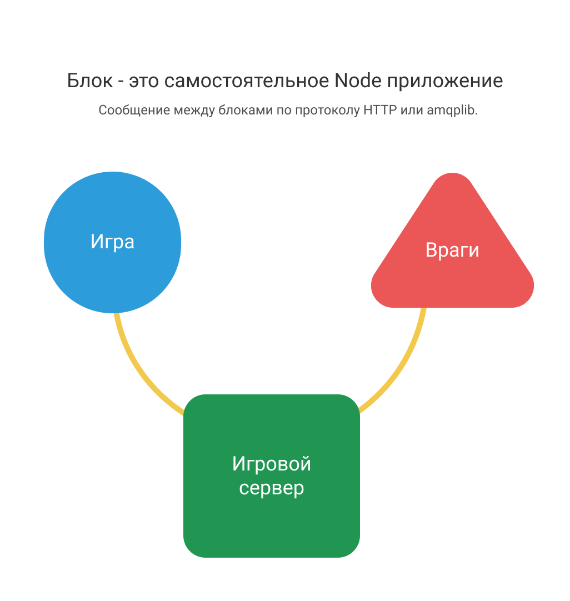

# Игровой сервер
Сервер для обмена информацией между клиентами.

#### [Команды для запуска](commands.md)

## Возможности
* При подключении клиент получает полную информацию о всех подключённых.
* Получение и отправка только изменившейся информации всем подключённым.
* Абстрагирован от специфичной логики:
  * Для создания общего обновляемого состояния (врагов) для всех клиентов, предлагается использовать отдельное Node приложение (apps), которое будет общаться с игровым сервером по amqplib | http со специфичным типом передаваемой информации. Для этого потребуется имплементировать обработчик событий на игровом сервере, который будет вызывать метод обработки специфичных типов реализованное в отдельном приложении.

## Документация API
* Подключение к серверу:
  ```js
  const apiUri = 'http://5.63.159.2:3000';

  connection = io.connect(apiUri, {
    transports: ['websocket'],
  });
  ```

* Подписка на успешное подключение:
  ```js
  connection.on('connected', ({ clientId, clients }) => {
    /* clientId - идентификатор клиента. */
    /* clients - полная информация о всех подключённых. */
  });
  ```

* Отправка информации на сервер для обновления:
  ```js
  connection.emit('update', {
    type: 'client',
    payload: { /* информация для обновления. */ },
  });
  ```

* Подписка на обновления клиентской информации:
  ```js
  connection.on('updates', (updates) => {
    /* updates - обновлённая информация. */
  });
  ```

* Подписка на получение идентификатора отключившегося:
  ```js
  connection.on('disconnected', ({ clientId }) => {
    /* clientId - идентификатор отключившегося. */
  });
  ```

### Лицензия [MIT](http://opensource.org/licenses/MIT)
Copyright (c) 2018-present, Лебедев Вячеслав


